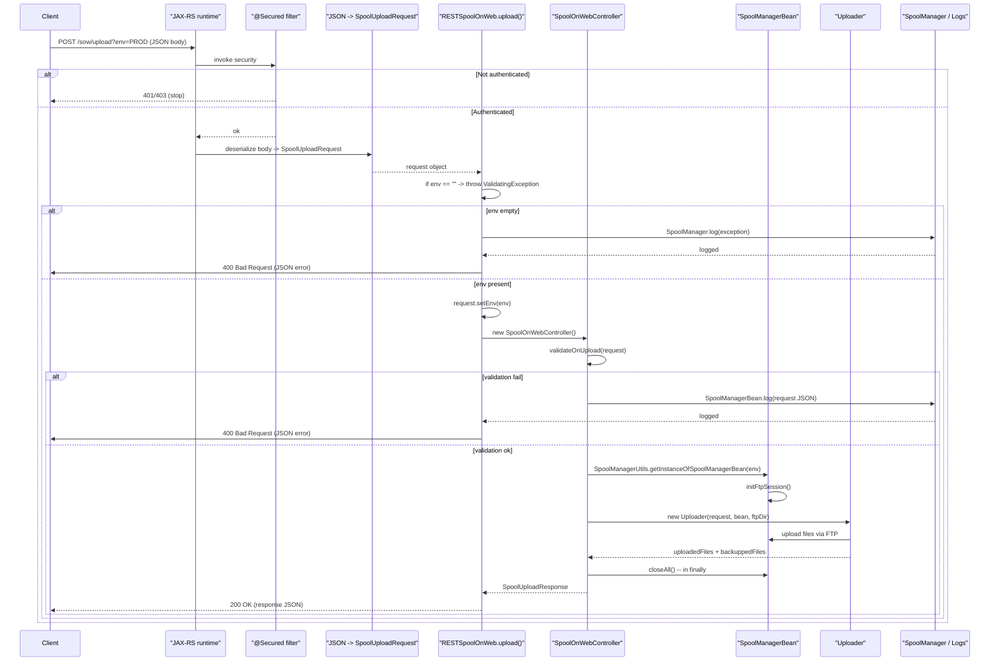

# API: POST /sow/upload

Documento di riferimento per l'endpoint `/sow/upload` (Spool On Web - upload).

**Percorso file:** `docs/sow-upload-api.md` (generato automaticamente)

---

## Sintesi
- Endpoint: `POST /sow/upload?env=<env>`
- Consumes: `application/json`
- Autenticazione: richiesta (annotazione `@Secured`)
- Scopo: caricare uno spool (file) in un ambiente specificato e opzionalmente eseguire unzip/backup

## Descrizione passo‑passo
1. Il client invia una richiesta HTTP `POST` a `/sow/upload` con il query parameter `env` e il body JSON.
2. Il container JAX-RS instrada la richiesta al metodo `RESTSpoolOnWeb.upload`.
3. Viene eseguito il filtro/interceptor di sicurezza associato a `@Secured`. Se l'autenticazione fallisce, la richiesta termina con `401`/`403`.
4. Il body JSON viene deserializzato in un oggetto `SpoolUploadRequest`.
5. Il metodo `upload` controlla se `env` è presente; se mancante o vuoto, viene lanciata `ValidatingException`.
6. `request.setEnv(env)` viene chiamato per assicurare che l'oggetto request conosca l'ambiente.
7. Viene creato un `SpoolOnWebController` e invocato `ctrl.upload(request)`.
8. `SpoolOnWebController.upload`:
   - Logga il request (JSON).
   - Valida i campi obbligatori nel request (contentBase64, metaData, metaData.directory, metaData.name).
   - Recupera `SpoolManagerBean` per l'ambiente e apre la sessione FTP (`initFtpSession`).
   - Crea un `Uploader` e chiama `uploader.upload()` per trasferire i file.
   - Costruisce `SpoolUploadResponse` con informazioni su `uploadedFiles` e `backuppedFiles`.
   - Chiude le risorse (`bean.closeAll()`) nel blocco `finally`.
9. Se `ctrl.upload(request)` termina con successo, il valore ritornato viene usato come entity della risposta HTTP `200 OK`.
10. In caso di eccezione (validation o runtime), `RESTSpoolOnWeb` cattura l'eccezione, la logga tramite `SpoolManager.log(t)` e restituisce una risposta JSON di errore:
    - `400 Bad Request` per `ValidatingException` (input non valido)
    - `500 Internal Server Error` per altre eccezioni
    - Body di errore: `{ "error": "<messaggio>", "stackTrace": "<stacktrace>" }`

---

## Payload - `SpoolUploadRequest`
Campi principali (classe: `com.rds_software.release.commons.ws.rest.sow.model.SpoolUploadRequest`):

- `env` (String) - impostato dal server dal query param, non è necessario fornirlo nel body (se fornito, verrà sovrascritto)
- `user` (String) - opzionale
- `unzip` (boolean) - default `false` - se true può indicare che il contenuto deve essere unzip
- `backup` (boolean) - default `false` - se true richiede un backup prima della sovrascrittura
- `contentBase64` (String) - OBBLIGATORIO - contenuto del file codificato in Base64
- `metaData` (SpoolMetaData) - OBBLIGATORIO - deve includere almeno `directory` e `name`

Esempio di body JSON:

```json
{
  "user": "stefano",
  "unzip": false,
  "backup": true,
  "contentBase64": "UEsDB...==",
  "metaData": {
    "directory": "MYDIR",
    "name": "SPOOL001"
  }
}
```

> Nota: il server sovrascrive `env` con il valore del query param.

---

## Risposte
- Successo
  - Status: `200 OK`
  - Content-Type: tipicamente `application/json` (non esplicitato nel metodo; dipende dai provider JAX-RS)
  - Body: `SpoolUploadResponse` (oggetto con almeno `uploadedFiles` e `backuppedFiles`)

Esempio ipotetico di risposta di successo:

```json
{
  "uploadedFiles": ["SPOOL001", "XML_SPOOL001"],
  "backuppedFiles": "SPOOL001,OLD_SPOOL"
}
```

- Errori di validazione (client)
  - Status: `400 Bad Request`
  - Content-Type: `application/json`
  - Body:

```json
{
  "error": "metaData.name attribute in payload is missing or blank",
  "stackTrace": "...stack trace..."
}
```

- Errori server
  - Status: `500 Internal Server Error`
  - Content-Type: `application/json`
  - Body: come sopra con `error` e `stackTrace`

---

## Controlli e validazioni applicate
- `env` (query param) non può essere vuoto (controllo in `RESTSpoolOnWeb.upload`).
- `SpoolOnWebController.validateOnUpload` verifica:
  - `contentBase64` non vuoto
  - `metaData` non nullo
  - `metaData.directory` non vuoto
  - `metaData.name` non vuoto

---

## Sicurezza e considerazioni operative
- `@Secured` indica che l'accesso richiede autenticazione/autorizzazione: controllare l'implementazione di `@Secured` per i dettagli su token/headers.
- Lo stack trace viene incluso nella risposta JSON: valutare di rimuovere questa esposizione in produzione per non rivelare informazioni sensibili.
- Il controller apre sessioni FTP: gestire i limiti di connessioni e i timeout in ambiente di produzione.

---

## Note implementative utili
- `SpoolOnWebController.upload` chiama `bean.initFtpSession()` e `uploader.upload()`; gli errori I/O possono originare `IOException` o eccezioni runtime specifiche.
- `request` viene loggato via `SpoolManagerBean.log(new Gson().toJson(request))` — attenzione a non loggare contenuti sensibili (es. payload base64) in produzione.
- Suggerimento: aggiungere `@Produces(MediaType.APPLICATION_JSON)` al metodo REST per rendere esplicito il `Content-Type` della risposta.

---

## Diagramma di sequenza (Mermaid)
Copia il blocco qui sotto in un renderer Mermaid per visualizzare il diagramma.



---

## Miglioramenti suggeriti
- Esplicitare `@Produces(MediaType.APPLICATION_JSON)` su `RESTSpoolOnWeb.upload`.
- Evitare l'esposizione dello stack trace in produzione (restituire un ID di errore e loggare internamente lo stack).
- Limitare il logging del contenuto `contentBase64` sensibile o mascherarlo.

---

## Riferimenti alle classi nel codice
- `RESTSpoolOnWeb` - `src/.../ws/rest/RESTSpoolOnWeb.java`
- `SpoolUploadRequest` - `src/.../ws/rest/sow/model/SpoolUploadRequest.java`
- `SpoolOnWebController` - `src/.../ws/rest/sow/model/SpoolOnWebController.java`


---

Se vuoi, posso:
- aggiungere `@Produces(MediaType.APPLICATION_JSON)` al metodo con una patch,
- generare un'immagine SVG/png del diagramma Mermaid,
- aggiungere documentazione per `SpoolUploadResponse` e `SpoolMetaData` (apro i file e li documento).

